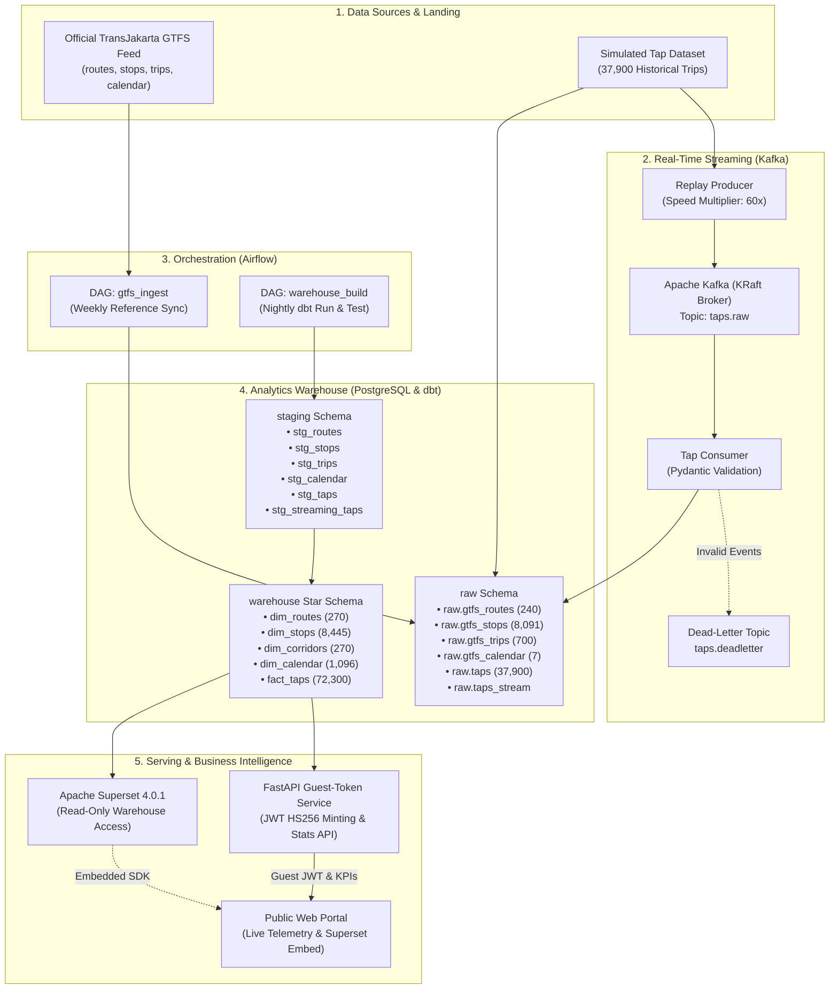

# KoridorTJ — TransJakarta Transit Data Platform

[](https://github.com/robitalhazmi/koridortj/actions/workflows/ci.yml)
[](https://github.com/robitalhazmi/koridortj/actions/workflows/cd.yml)
[](dbt/)
[](https://github.com/astral-sh/ruff)
[](https://www.python.org/)
[](LICENSE)

An end-to-end modern transit data engineering and business intelligence platform built on Jakarta’s **TransJakarta** Bus Rapid Transit (BRT) network.

KoridorTJ ingests official open transit feeds (GTFS routes, stops, schedules), combines them with a high-throughput simulated tap-in/tap-out transaction streaming pipeline, models an analytical Star Schema warehouse with **dbt**, orchestrates idempotent workflows with **Apache Airflow**, and serves public embedded intelligence dashboards via **Apache Superset** and a **FastAPI** token microservice.

---

> ### 📢 Data Provenance & Synthetic Disclaimer
> - **Transit Network Structure (Routes, Stops, Schedules):** Ingested directly from official TransJakarta open GTFS reference feeds published under CC BY 4.0.
> - **Passenger Tap Transactions (Fact Data):** All transaction records and ridership volumes are **simulated/synthetic data** modeled for portfolio demonstration purposes (`is_simulated = TRUE` enforced across all tables and analytical models).

---

## 🏗️ Architecture Overview



---

## ⚙️ Tech Stack & Key Components

| Layer | Technology | Role & Key Features |
|---|---|---|
| **Data Warehouse** | PostgreSQL 16 | Star schema analytics storage, indexed surrogate keys, role-based isolation (`ingestion_user`, `superset_ro`). |
| **Data Transformation** | dbt-core 1.8 | Modular staging and dimensional models, incremental streaming merges, automated documentation & catalog. |
| **Orchestration** | Apache Airflow 2.9 | Idempotent DAGs (`gtfs_ingest_dag`, `warehouse_build_dag`), failure handling, and pipeline scheduling. |
| **Streaming Engine** | Apache Kafka 3.7 (KRaft) | Event stream replay with configurable velocity multiplier, Pydantic event validation, and Dead-Letter Queue (DLQ). |
| **Business Intelligence** | Apache Superset 4.0.1 | Transit ridership dashboards, peak hour breakdown, card issuer distribution, and corridor rank analysis. |
| **API & Embed Portal** | FastAPI (Python 3.12) | Guest JWT token generator, real-time KPI aggregation service, and static single-page application. |
| **Data Governance** | dbt tests & Pydantic | **80 data quality tests** (100% pass rate), schema boundary checks, custom referential integrity, and fare constraints. |
| **Containerization** | Docker & Compose | Multi-container stack right-sized for 4GB–8GB VPS (~4.3 GB total RAM budget) with resource limits. |
| **CI / CD** | GitHub Actions & GHCR | Automated Ruff linter, Pytest suite, ephemeral PostgreSQL dbt test runner, GHCR image publishing, and Coolify webhook. |

---

## 📊 Dimensional Star Schema

```text
               ┌────────────────────┐
               │    dim_routes      │
               ├────────────────────┤
               │ PK route_id        │◄──────────┐
               │    route_short_name│           │
               │    route_long_name │           │
               │    route_type      │           │
               └────────────────────┘           │
                                                │
┌───────────────────┐                  ┌────────┴───────────┐                  ┌───────────────────┐
│   dim_calendar    │                  │     fact_taps      │                  │     dim_stops     │
├───────────────────┤                  ├────────────────────┤                  ├───────────────────┤
│ PK date_id        │◄─────────────────┤ PK tap_id          │─────────────────►│ PK stop_id        │
│    full_date      │                  │ FK date_id         │                  │    stop_name      │
│    day_of_week    │                  │ FK route_id        │                  │    latitude       │
│    is_weekend     │                  │ FK stop_id         │                  │    longitude      │
│    quarter        │                  │ FK corridor_code   │                  │    corridor_id    │
└───────────────────┘                  │    trans_id        │                  └───────────────────┘
                                       │    pay_card_id     │
                                       │    pay_card_bank   │
                                       │    tap_type (IN/OUT)
                                       │    tap_timestamp   │
                                       │    pay_amount      │
                                       │    is_simulated    │
                                       └────────┬───────────┘
                                                │
                                       ┌────────┴───────────┐
                                       │   dim_corridors    │
                                       ├────────────────────┤
                                       │ PK corridor_code   │
                                       │    corridor_name   │
                                       │    route_count     │
                                       │    stop_count      │
                                       └────────────────────┘
```

For full column descriptions, refer to the [Data Dictionary](docs/data_dictionary.md) and [Entity-Relationship Diagram](docs/erd.md).

---

## 🛡️ Data Quality & Governance Gates

The platform enforces data quality at both **ingestion boundaries** and **warehouse transformations**:

- **Pydantic Model Validation:** Every raw GTFS record and streaming tap transaction is validated against typed Pydantic schemas before persistence.
- **80 Automated dbt Data Tests (100% Pass Rate):**
  - **Schema Constraints:** `not_null`, `unique`, and `relationships` foreign key integrity across all dimensions and facts.
  - **Domain Validation:** `accepted_values` on `tap_type` (`IN`, `OUT`), `direction` (`0`, `1`), `route_type` (`3`), `is_weekend`, `quarter`.
  - **Custom Singular Business Rule Tests:**
    1. `assert_no_future_tap_timestamps.sql`: Ensures no transaction timestamp exceeds execution wall-clock time (`tap_timestamp <= now()`).
    2. `assert_tap_out_after_tap_in.sql`: Verifies `tap_out_time >= tap_in_time` across all trips.
    3. `assert_fact_taps_referential_integrity.sql`: Validates 100% referential integrity against `dim_stops` and `dim_routes`.
    4. `assert_valid_fare_amounts.sql`: Asserts fares are non-negative, bounded (`0 <= fare <= 50,000`), and tap-outs equal `Rp 0.00`.
    5. `assert_valid_stop_coordinates.sql`: Validates GPS coordinates within the Greater Jakarta bounding box (`lat: [-7.0, -5.5], lon: [106.3, 107.5]`).

---

## 🚀 Quickstart & Local Setup

### 1. Prerequisites
- [Docker](https://docs.docker.com/engine/install/) and [Docker Compose](https://docs.docker.com/compose/) (v2.20+)
- [Python 3.12](https://www.python.org/) with `pip`
- (Optional) [Miniconda / Virtualenv](https://docs.conda.io/en/latest/)

### 2. Clone Repository & Setup Environment
```bash
git clone https://github.com/robitalhazmi/koridortj.git
cd koridortj

# Copy environment template
cp .env.example .env
```

### 3. Launch Docker Compose Stack
```bash
# Start Core Platform (PostgreSQL, Kafka, Airflow, Superset, Token Service)
docker compose up -d

# Check service health
docker compose ps
```

### 4. Service Endpoints

| Service | Local URL | Credentials / Notes |
|---|---|---|
| **Public Web Portal & Stats API** | [http://localhost:8000](http://localhost:8000) | Public (Live KPI metrics, Chart.js analytics & embedded dashboard) |
| **API Docs (Swagger UI)** | [http://localhost:8000/docs](http://localhost:8000/docs) | Interactive OpenAPI documentation |
| **Apache Superset** | [http://localhost:8088](http://localhost:8088) | `admin` / `admin` |
| **Apache Airflow UI** | [http://localhost:8080](http://localhost:8080) | `admin` / `admin` |
| **PostgreSQL Warehouse** | `localhost:5432` | `warehouse` / `postgres` (`postgres_dev_password`) |

---

## 🧪 Testing & Verification Runbook

### Run Python Unit & Schema Tests
```bash
pip install -r requirements-dev.txt
pytest -v tests/
```

### Run Code Formatting & Linting
```bash
# Check code style with Ruff
ruff check .

# Check code formatting
ruff format --check .
```

### Run dbt Models & Data Quality Tests
```bash
# Run dbt transformations
dbt run --project-dir dbt --profiles-dir dbt

# Execute 80 data quality tests
dbt test --project-dir dbt --profiles-dir dbt

# Generate and serve interactive dbt documentation
dbt docs generate --project-dir dbt --profiles-dir dbt
dbt docs serve --project-dir dbt --profiles-dir dbt --port 8081
```

### Run Streaming Replay Producer & Consumer
```bash
# Start Streaming Replay Producer (60x speed multiplier)
python ingestion/replay_producer.py --speed-multiplier 60 --loop

# Start Streaming Consumer (in a separate terminal)
python ingestion/tap_consumer.py --batch-size 250
```

---

## 🚢 Production Deployment (Coolify VPS)

For step-by-step production deployment instructions, Traefik HTTPS domain routing, managed database setup, backup policies, and resource tuning, see the [Production Deployment Guide](docs/deployment_guide.md).

---

## 📚 Documentation Index

- [Walkthrough & Architecture Story](WALKTHROUGH.md)
- [Technical Implementation Plan](IMPLEMENTATION_PLAN.md)
- [Development Task Checklist](TASKS.md)
- [Data Sources & Provenance](docs/data_sources.md)
- [Data Dictionary & Contracts](docs/data_dictionary.md)
- [Entity-Relationship Diagram (ERD)](docs/erd.md)
- [Coolify Production Deployment Guide](docs/deployment_guide.md)

---

## 📄 License

This project is licensed under the [MIT License](LICENSE).
TransJakarta GTFS reference data is provided by PT Transportasi Jakarta under [CC BY 4.0](https://creativecommons.org/licenses/by/4.0/).
All transaction fact data is synthetic and generated for portfolio demonstration purposes.
