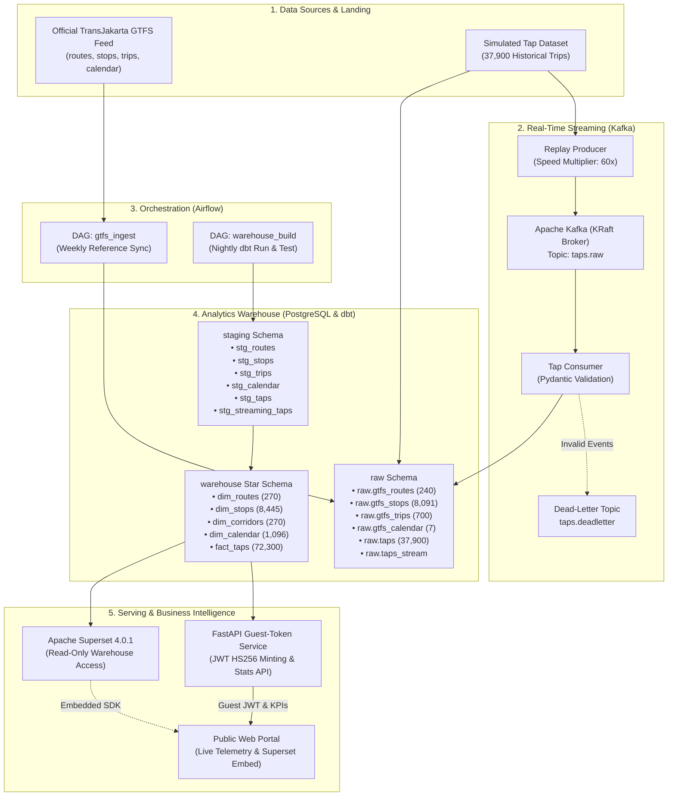

# KoridorTJ — TransJakarta Transit Data Platform

[](https://github.com/robitalhazmi/koridortj/actions/workflows/ci.yml)
[](https://github.com/robitalhazmi/koridortj/actions/workflows/cd.yml)
[](dbt/)
[](https://github.com/astral-sh/ruff)
[](https://www.python.org/)
[](LICENSE)

An end-to-end modern transit data engineering and business intelligence platform built on Jakarta’s **TransJakarta** Bus Rapid Transit (BRT) network.

KoridorTJ ingests official open transit feeds (GTFS routes, stops, schedules), combines them with a high-throughput simulated tap-in/tap-out transaction streaming pipeline, models an analytical Star Schema warehouse with **dbt**, orchestrates idempotent workflows with **Apache Airflow**, and serves public embedded intelligence dashboards via **Apache Superset** and a **FastAPI** token microservice.

---

> ### 📢 Data Provenance & Synthetic Disclaimer
> - **Transit Network Structure (Routes, Stops, Schedules):** Ingested directly from official TransJakarta open GTFS reference feeds published under CC BY 4.0.
> - **Passenger Tap Transactions (Fact Data):** All transaction records and ridership volumes are **simulated/synthetic data** modeled for portfolio demonstration purposes (`is_simulated = TRUE` enforced across all tables and analytical models).

---

## 🏗️ Architecture Overview


```mermaid
flowchart TD
    subgraph Sources ["1. Data Sources & Landing"]
        GTFS["Official TransJakarta GTFS Feed<br/>(routes, stops, trips, calendar)"]
        TapsHist["Simulated Tap Dataset<br/>(37,900 Historical Trips)"]
    end

    subgraph Streaming ["2. Real-Time Streaming (Kafka)"]
        Producer["Replay Producer<br/>(Speed Multiplier: 60x)"]
        Kafka["Apache Kafka (KRaft Broker)<br/>Topic: taps.raw"]
        DLQ["Dead-Letter Topic<br/>taps.deadletter"]
        Consumer["Tap Consumer<br/>(Pydantic Validation)"]
    end

    subgraph Orchestration ["3. Orchestration (Airflow)"]
        DAG1["DAG: gtfs_ingest<br/>(Weekly Reference Sync)"]
        DAG2["DAG: warehouse_build<br/>(Nightly dbt Run & Test)"]
    end

    subgraph Warehouse ["4. Analytics Warehouse (PostgreSQL & dbt)"]
        Raw["raw Schema<br/>• raw.gtfs_routes (240)<br/>• raw.gtfs_stops (8,091)<br/>• raw.gtfs_trips (700)<br/>• raw.gtfs_calendar (7)<br/>• raw.taps (37,900)<br/>• raw.taps_stream"]
        Staging["staging Schema<br/>• stg_routes<br/>• stg_stops<br/>• stg_trips<br/>• stg_calendar<br/>• stg_taps<br/>• stg_streaming_taps"]
        StarSchema["warehouse Star Schema<br/>• dim_routes (270)<br/>• dim_stops (8,445)<br/>• dim_corridors (270)<br/>• dim_calendar (1,096)<br/>• fact_taps (72,300)"]
    end

    subgraph Serving ["5. Serving & Business Intelligence"]
        Superset["Apache Superset 4.0.1<br/>(Read-Only Warehouse Access)"]
        TokenAPI["FastAPI Guest-Token Service<br/>(JWT HS256 Minting & Stats API)"]
        WebPortal["Public Web Portal<br/>(Live Telemetry & Superset Embed)"]
    end

    GTFS --> DAG1 --> Raw
    TapsHist --> Raw
    TapsHist --> Producer --> Kafka --> Consumer --> Raw
    Consumer -.->|Invalid Events| DLQ
    DAG2 --> Staging --> StarSchema
    StarSchema --> Superset
    StarSchema --> TokenAPI
    Superset -.->|Embedded SDK| WebPortal
    TokenAPI -->|Guest JWT & KPIs| WebPortal
```

---

## ⚙️ Tech Stack & Key Components

| Layer | Technology | Role & Key Features |
|---|---|---|
| **Data Warehouse** | PostgreSQL 16 | Star schema analytics storage, indexed surrogate keys, role-based isolation (`ingestion_user`, `superset_ro`). |
| **Data Transformation** | dbt-core 1.8 | Modular staging and dimensional models, incremental streaming merges, automated documentation & catalog. |
| **Orchestration** | Apache Airflow 2.9 | Idempotent DAGs (`gtfs_ingest_dag`, `warehouse_build_dag`), failure handling, and pipeline scheduling. |
| **Streaming Engine** | Apache Kafka 3.7 (KRaft) | Event stream replay with configurable velocity multiplier, Pydantic event validation, and Dead-Letter Queue (DLQ). |
| **Business Intelligence** | Apache Superset 4.0.1 | Transit ridership dashboards, peak hour breakdown, card issuer distribution, and corridor rank analysis. |
| **API & Embed Portal** | FastAPI (Python 3.12) | Guest JWT token generator, real-time KPI aggregation service, and static single-page application. |
| **Data Governance** | dbt tests & Pydantic | **80 data quality tests** (100% pass rate), schema boundary checks, custom referential integrity, and fare constraints. |
| **Containerization** | Docker & Compose | Multi-container stack right-sized for 4GB–8GB VPS (~4.3 GB total RAM budget) with resource limits. |
| **CI / CD** | GitHub Actions & GHCR | Automated Ruff linter, Pytest suite, ephemeral PostgreSQL dbt test runner, GHCR image publishing, and Coolify webhook. |

---

## 📊 Dimensional Star Schema

```text
               ┌────────────────────┐
               │    dim_routes      │
               ├────────────────────┤
               │ PK route_id        │◄──────────┐
               │    route_short_name│           │
               │    route_long_name │           │
               │    route_type      │           │
               └────────────────────┘           │
                                                │
┌───────────────────┐                  ┌────────┴───────────┐                  ┌───────────────────┐
│   dim_calendar    │                  │     fact_taps      │                  │     dim_stops     │
├───────────────────┤                  ├────────────────────┤                  ├───────────────────┤
│ PK date_id        │◄─────────────────┤ PK tap_id          │─────────────────►│ PK stop_id        │
│    full_date      │                  │ FK date_id         │                  │    stop_name      │
│    day_of_week    │                  │ FK route_id        │                  │    latitude       │
│    is_weekend     │                  │ FK stop_id         │                  │    longitude      │
│    quarter        │                  │ FK corridor_code   │                  │    corridor_id    │
└───────────────────┘                  │    trans_id        │                  └───────────────────┘
                                       │    pay_card_id     │
                                       │    pay_card_bank   │
                                       │    tap_type (IN/OUT)
                                       │    tap_timestamp   │
                                       │    pay_amount      │
                                       │    is_simulated    │
                                       └────────┬───────────┘
                                                │
                                       ┌────────┴───────────┐
                                       │   dim_corridors    │
                                       ├────────────────────┤
                                       │ PK corridor_code   │
                                       │    corridor_name   │
                                       │    route_count     │
                                       │    stop_count      │
                                       └────────────────────┘
```

For full column descriptions, refer to the [Data Dictionary](docs/data_dictionary.md) and [Entity-Relationship Diagram](docs/erd.md).

---

## 🛡️ Data Quality & Governance Gates

The platform enforces data quality at both **ingestion boundaries** and **warehouse transformations**:

- **Pydantic Model Validation:** Every raw GTFS record and streaming tap transaction is validated against typed Pydantic schemas before persistence.
- **80 Automated dbt Data Tests (100% Pass Rate):**
  - **Schema Constraints:** `not_null`, `unique`, and `relationships` foreign key integrity across all dimensions and facts.
  - **Domain Validation:** `accepted_values` on `tap_type` (`IN`, `OUT`), `direction` (`0`, `1`), `route_type` (`3`), `is_weekend`, `quarter`.
  - **Custom Singular Business Rule Tests:**
    1. `assert_no_future_tap_timestamps.sql`: Ensures no transaction timestamp exceeds execution wall-clock time (`tap_timestamp <= now()`).
    2. `assert_tap_out_after_tap_in.sql`: Verifies `tap_out_time >= tap_in_time` across all trips.
    3. `assert_fact_taps_referential_integrity.sql`: Validates 100% referential integrity against `dim_stops` and `dim_routes`.
    4. `assert_valid_fare_amounts.sql`: Asserts fares are non-negative, bounded (`0 <= fare <= 50,000`), and tap-outs equal `Rp 0.00`.
    5. `assert_valid_stop_coordinates.sql`: Validates GPS coordinates within the Greater Jakarta bounding box (`lat: [-7.0, -5.5], lon: [106.3, 107.5]`).

---

## 🚀 Quickstart & Local Setup

### 1. Prerequisites
- [Docker](https://docs.docker.com/engine/install/) and [Docker Compose](https://docs.docker.com/compose/) (v2.20+)
- [Python 3.12](https://www.python.org/) with `pip`
- (Optional) [Miniconda / Virtualenv](https://docs.conda.io/en/latest/)

### 2. Clone Repository & Setup Environment
```bash
git clone https://github.com/robitalhazmi/koridortj.git
cd koridortj

# Copy environment template
cp .env.example .env
```

### 3. Launch Local Dev / Compute Stack
The pipeline uses a two-environment architecture. The heavy data ingestion, Airflow orchestration, Kafka streaming, and dbt transformations run locally on your dev machine:

```bash
# Start Local Dev Stack (PostgreSQL 16, Kafka KRaft, Airflow, Streaming Replay Workers)
docker compose -f docker-compose.dev.yml up -d

# Verify container health
docker compose -f docker-compose.dev.yml ps
```

### 4. Local Service Endpoints

| Service | Local URL | Credentials / Notes |
|---|---|---|
| **Apache Airflow UI** | [http://localhost:8080](http://localhost:8080) | `admin` / `admin` (DAG orchestration & scheduling) |
| **PostgreSQL Dev Warehouse** | `localhost:5432` | `warehouse` / `postgres` (`postgres_dev_password`) |
| **Apache Kafka (KRaft)** | `localhost:9092` | Internal streaming broker (`taps.raw`, `taps.deadletter`) |

---

## 🧪 Testing & Local Verification Runbook

### Run Python Unit & Schema Tests
```bash
pip install -r requirements-dev.txt
pytest -v tests/
```

### Run Code Formatting & Linting
```bash
# Check code style with Ruff
ruff check .

# Check code formatting
ruff format --check .
```

### Trigger Pipeline DAGs & dbt Tests
```bash
# Trigger GTFS ingestion DAG
docker compose -f docker-compose.dev.yml exec airflow-webserver airflow dags trigger gtfs_ingest

# Trigger warehouse build DAG (dbt transformations & data quality tests)
docker compose -f docker-compose.dev.yml exec airflow-webserver airflow dags trigger warehouse_build

# Or run dbt directly
(cd dbt && dbt run && dbt test)
```

### Run Streaming Replay Producer & Consumer
```bash
# Start Streaming Replay Producer (60x speed multiplier)
python ingestion/replay_producer.py --speed-multiplier 60 --loop

# Start Streaming Consumer (in a separate terminal)
python ingestion/tap_consumer.py --batch-size 250
```

---

## 🚀 Dev → Prod Promotion Pipeline & Cadence

KoridorTJ separates the heavy compute environment from the production serving layer. The promotion script is the sole, deliberate bridge connecting the local dev warehouse to the public demo on the VPS.

### 📅 Promotion Cadence
- **Manual Trigger**: Promotion is executed manually whenever you want the public demo and dashboard refreshed with a newly validated pipeline run.
- **Not on Every Run**: Local Airflow DAGs run frequently during development without touching production. Only when a run satisfies all data quality checks do you promote the resulting star schema models to the VPS.

### 🔄 Promotion Workflow (`./scripts/promote_to_prod.sh`)
When executed from your local machine, the promotion script automatically carries out four gated phases:

1. **Pre-promotion Quality Gate**: Re-runs all **80 dbt data tests** against your local dev PostgreSQL warehouse. If any test fails, the script **halts immediately** with a non-zero exit code and refuses to promote.
2. **Conformed Model Dump**: Performs a clean, schema-isolated `pg_dump` of only the conformed dimensional tables (`dim_routes`, `dim_stops`, `dim_corridors`, `dim_calendar`, `fact_taps`), ignoring raw/staging tables.
3. **SSH-Tunneled Streaming & Restore**: Connects securely over SSH to the VPS and streams the SQL dump directly into the production PostgreSQL container (`psql -v ON_ERROR_STOP=1`). It automatically grants read-only `SELECT` privileges to `superset_ro` and prints restored row counts for verification.
4. **dbt Docs Regeneration & Static Publishing**: Executes `dbt docs generate`, stages the static artifacts (`index.html`, `manifest.json`, `catalog.json`) into `web/dbt_docs/`, and streams the updated catalog directly to the production `token-service` container at `/app/web/dbt_docs/`.

### 💻 Executing the Promotion
```bash
# Ensure PROD_SSH_HOST and production credentials are set in .env
./scripts/promote_to_prod.sh
```

---

## 🚢 Production Serving Layer (Coolify VPS)

The production serving layer is deployed via **Coolify** on a lightweight VPS (1 vCPU / 2GB RAM budget) using [`docker-compose.prod.yml`](docker-compose.prod.yml):

- **Production PostgreSQL 16**: Managed resource in Coolify hosting `warehouse` and `superset_meta`.
- **Apache Superset 4.0.1**: Lean single-worker container (`WEB_CONCURRENCY=1`, memory capped at 768MB) with read-only database access.
- **FastAPI Guest Token & Web Portal**: Issues short-lived JWT guest tokens for dashboard embedding, serves real-time KPI aggregates, and hosts the interactive web portal and compiled `dbt docs`.

### Production Endpoints

| Service / View | URL / Routing | Purpose |
|---|---|---|
| **Public Web Portal & Dashboard** | `https://koridortj.yourdomain.com` | Live analytics portal & embedded Superset dashboard |
| **Interactive dbt Docs & Lineage** | `https://koridortj.yourdomain.com/dbt_docs/` | Static dbt data catalog, lineage graph, and data dictionary |
| **Live Telemetry & Stats API** | `https://koridortj.yourdomain.com/api/stats` | JSON analytics aggregates from production warehouse |
| **API Documentation (Swagger UI)** | `https://koridortj.yourdomain.com/docs` | Interactive OpenAPI documentation |

For step-by-step production deployment instructions, Traefik HTTPS domain routing, and security hardening, see the [Production Deployment Guide](docs/deployment_guide.md).

---

## 📚 Documentation Index

- [Walkthrough & Architecture Story](WALKTHROUGH.md)
- [Technical Implementation Plan](IMPLEMENTATION_PLAN.md)
- [Development Task Checklist](TASKS.md)
- [Data Sources & Provenance](docs/data_sources.md)
- [Data Dictionary & Contracts](docs/data_dictionary.md)
- [Entity-Relationship Diagram (ERD)](docs/erd.md)
- [Coolify Production Deployment Guide](docs/deployment_guide.md)

---

## 📄 License

This project is licensed under the [MIT License](LICENSE).
TransJakarta GTFS reference data is provided by PT Transportasi Jakarta under [CC BY 4.0](https://creativecommons.org/licenses/by/4.0/).
All transaction fact data is synthetic and generated for portfolio demonstration purposes.
