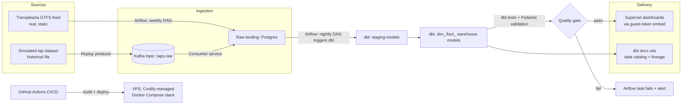

# KoridorTJ — A Transjakarta Data Platform
*A portfolio project built to demonstrate the Data Engineer skill set*

> Working name: **KoridorTJ**. Rename it to whatever you like — the repo, the DAGs, and the dbt project are all named generically enough to make renaming a find-and-replace job.

---

## 1. Elevator pitch

KoridorTJ is an end-to-end data platform built around Jakarta's Transjakarta BRT network. It ingests **real, official Transjakarta open transit data** (routes, stops, schedules), combines it with a **publicly available, clearly-labeled simulated tap-in/tap-out transaction dataset**, and turns both into a governed, tested, documented analytics warehouse with a public dashboard.

It's deliberately shaped to mirror what a data engineering team at a transportation company actually does day to day: pull data from multiple sources on a schedule, model it into a clean warehouse, guard it with data quality checks, document it so analysts can self-serve, and ship it through CI/CD to a real running environment — not just a Jupyter notebook.

## 2. Why this project, and why this data

A transit-domain project speaks directly to the role instead of being a generic "iris dataset" portfolio piece. Two data sources are combined:

1. **Real reference data** — Transjakarta's official GTFS feed (routes, stops, trips, calendars). This is real, live, and updates periodically, which is exactly the kind of "slowly changing reference data" a DE pipeline needs to handle correctly (new routes appear, old ones are retired, schedules change).
2. **Realistic fact data** — a public dataset of simulated tap-in/tap-out transactions, generated on top of the *real* route/stop structure. This is not real ridership data, and the project says so everywhere it's shown (see §8). It's used because no real transaction-level data is publicly available, and it lets the pipeline demonstrate high-volume, timestamped, streaming-shaped data honestly.

This combination means every component in the platform is doing something realistic and defensible, and the whole thing produces something that's actually informative about how the Transjakarta network is structured — while never claiming to show real ridership numbers it doesn't have.

## 3. Architecture at a glance



## 4. What actually happens when the pipeline runs (the story)

1. **Weekly**, an Airflow DAG downloads the current Transjakarta GTFS zip, validates its structure, and loads routes/stops/trips/calendar into raw landing tables in Postgres — handling the case where the feed hasn't changed, has changed, or is malformed (this is the "error handling in pipelines" line from the JD, made concrete).
2. **Continuously**, a small Python producer service replays the historical tap dataset at accelerated speed, publishing one JSON event per simulated tap to a Kafka topic (`taps.raw`) — timestamps rewritten to "now" so it behaves like a live feed.
3. A consumer service reads `taps.raw` and lands each event into a raw Postgres table, tagging any event that fails schema validation into a `taps.raw.deadletter` topic instead of silently dropping it.
4. **Nightly** (and on-demand), Airflow triggers `dbt run` then `dbt test`. dbt builds staging models, then a small star schema (`dim_routes`, `dim_stops`, `dim_corridors`, `dim_calendar`, `fact_taps`).
5. If any dbt test fails (referential integrity, nulls, out-of-range timestamps, tap-out-before-tap-in, etc.), the Airflow task fails loudly instead of quietly loading bad data — this is the data-quality/error-handling story end to end.
6. On success, Superset (already pointed at the warehouse) shows refreshed dashboards: ridership by corridor and hour, weekday vs. weekend patterns, busiest stops. A small guest-token service issues short-lived tokens so a public embed page can show these dashboards without requiring a login.
7. `dbt docs generate` publishes a browsable data catalog with column-level descriptions and a lineage graph — this is the "documentation for data models and system flows" line, made real and clickable instead of a static Word doc.
8. Every push to `main` runs CI (lint, unit tests, `dbt test` against an ephemeral database) and, if it passes, CD builds Docker images and deploys the stack to your VPS.

## 5. How this maps to the job description

| JD requirement | Where it lives in KoridorTJ |
|---|---|
| Design and build data pipelines from various sources to a warehouse/lake | GTFS + Kafka-replayed taps → Postgres warehouse |
| Complex transformations in SQL/Python | dbt SQL models; Python ingestion & validation |
| Data quality practices and error handling | dbt tests, Pydantic schema validation, dead-letter topic |
| Optimize query performance and storage | Indexing/partitioning notes in Implementation Plan, incremental dbt models |
| Documentation of data models and system flows | dbt docs site, ERD, this walkthrough |
| Collaborate with analysts/data scientists | Superset self-serve dashboards + documented, tested warehouse |
| Golang/Java (plus) | Guest-token embed service (Phase 7) — a small, naturally-justified place to use Go |
| ETL/ELT, data modeling, orchestration (Airflow) | Airflow DAGs; ELT via dbt |
| Data warehouse/lake experience | Postgres warehouse (BigQuery mirror as stretch) |
| Streaming systems (Kafka, Pub/Sub) | Kafka (KRaft) replay pipeline |
| CI/CD, containerization, cloud infra | GitHub Actions + Docker Compose + VPS deployment |
| Data governance, metadata management | dbt docs catalog, data dictionary, ERD |

## 6. How to explore it

- Public dashboard: *(add your public embed page URL here once deployed)*
- Data catalog / lineage: *(add your hosted dbt docs URL here)*
- Architecture diagram & ERD: `/docs/architecture.md`, `/docs/erd.md`
- Build status: GitHub Actions badge in the repo README

## 7. Quick start (short version — full detail in `IMPLEMENTATION_PLAN.md`)

```bash
git clone <your-repo-url> && cd KoridorTJ
cp .env.example .env        # fill in secrets locally, never commit .env
docker compose up -d        # brings up Postgres, Kafka, Airflow, Metabase
docker compose exec airflow airflow dags trigger gtfs_ingest
```

## 8. Honesty note on the data

The transit **network structure** (routes, stops, schedules) is real, official Transjakarta open data. The **transaction/ridership volumes** shown in this project are simulated (Faker-generated) and do **not** represent actual passenger counts. Every dashboard and README in this repo says so explicitly — this project demonstrates a production-shaped pipeline safely, without publishing or implying real ridership statistics that were never collected.
