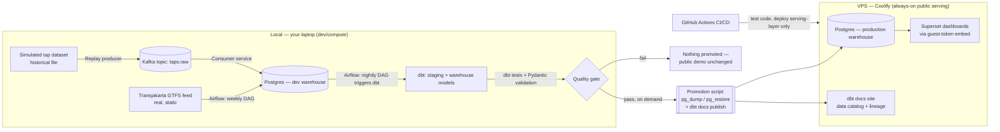

# KoridorTJ — A Transjakarta Data Platform
*A portfolio project built to demonstrate the Data Engineer skill set*

> Working name: **KoridorTJ**.

---

## 1. Elevator pitch

KoridorTJ is an end-to-end data platform built around Jakarta's Transjakarta BRT network. It ingests **real, official Transjakarta open transit data** (routes, stops, schedules), combines it with a **publicly available, clearly-labeled simulated tap-in/tap-out transaction dataset**, and turns both into a governed, tested, documented analytics warehouse with a public dashboard.

It's deliberately shaped to mirror what a data engineering team at a transportation company like Blue Bird actually does day to day: pull data from multiple sources on a schedule, model it into a clean warehouse, guard it with data quality checks, document it so analysts can self-serve, and ship it through CI/CD to a real running environment — not just a Jupyter notebook.

## 2. Why this project, and why this data

Blue Bird is a transportation and logistics company, so a transit-domain project speaks directly to the role instead of being a generic "iris dataset" portfolio piece. Two data sources are combined:

1. **Real reference data** — Transjakarta's official GTFS feed (routes, stops, trips, calendars). Real, live, and updates periodically, which is exactly the kind of "slowly changing reference data" a DE pipeline needs to handle correctly.
2. **Realistic fact data** — a public dataset of simulated tap-in/tap-out transactions, generated on top of the *real* route/stop structure. Not real ridership data, and the project says so everywhere it's shown (see §8).

## 3. Architecture at a glance

The project runs in two places on purpose (see §9 for why): heavy, bursty compute happens on your laptop, and only a lightweight serving layer stays always-on in public.


```mermaid
flowchart LR
    subgraph LOCAL["Local — your laptop (dev/compute)"]
        A[Transjakarta GTFS feed<br/>real, static]
        B[Simulated tap dataset<br/>historical file]
        A -->|Airflow: weekly DAG| C[(Postgres — dev warehouse)]
        B -->|Replay producer| D[(Kafka topic: taps.raw)]
        D -->|Consumer service| C
        C -->|Airflow: nightly DAG triggers dbt| E[dbt: staging + warehouse models]
        E -->|dbt tests + Pydantic validation| G{Quality gate}
    end

    G -->|pass, on demand| PROMOTE[["Promotion script:<br/>pg_dump / pg_restore<br/>+ dbt docs publish"]]
    G -->|fail| FAILNOTE[Nothing promoted —<br/>public demo unchanged]

    subgraph VPS["VPS — Coolify (always-on public serving)"]
        F[(Postgres — production warehouse)]
        H[Superset dashboards<br/>via guest-token embed]
        J[dbt docs site<br/>data catalog + lineage]
        F --> H
    end

    PROMOTE --> F
    PROMOTE --> J

    K[GitHub Actions CI/CD] -->|test code, deploy serving-layer only| VPS
```

## 4. What actually happens (the story)

1. On your **laptop**, a weekly Airflow DAG downloads the current Transjakarta GTFS zip and loads routes/stops/trips/calendar into a local dev Postgres — handling a missing, unchanged, or malformed feed gracefully (the JD's "error handling in pipelines" line, made concrete).
2. Also on your laptop, a replay producer republishes the historical tap dataset onto a local Kafka topic at accelerated speed; a consumer validates each event and lands good ones in the dev Postgres, bad ones in a dead-letter topic.
3. On demand (or nightly, while you're working), Airflow triggers `dbt run` then `dbt test` against the local dev warehouse, building `dim_routes`, `dim_stops`, `dim_corridors`, `dim_calendar`, and `fact_taps`.
4. When you're happy with a run — all dbt tests green — you run a **promotion script**: it re-checks the dbt tests one more time, `pg_dump`s the finished warehouse tables, opens a short-lived SSH tunnel to the VPS, and `pg_restore`s into the **production** Postgres. It also regenerates and republishes the dbt docs static site.
5. The **VPS**, managed by Coolify, only ever runs the always-on serving layer: the production Postgres, a trimmed Superset instance (no Celery/Redis — it only needs to serve pre-computed dashboards), the guest-token service, and the dbt docs site. No Airflow, no Kafka — nothing that needs to run continuously on a 1-vCPU box.
6. A visitor opens the public embed page; the guest-token service mints them a short-lived Superset token; Superset renders the dashboard straight from the production Postgres.
7. Every push to `main` runs CI (lint, pytest, `dbt test` against an ephemeral container). CD then redeploys only the **serving-layer code** (Superset config, guest-token service) to the VPS via Coolify's API. Pushing new *data* to production stays a deliberate, manual step (§4.4) — not something every git push triggers.

## 5. How this maps to the Blue Bird job description

| JD requirement | Where it lives in KoridorTJ |
|---|---|
| Design and build data pipelines from various sources to a warehouse/lake | GTFS + Kafka-replayed taps → local dev Postgres → promoted to production Postgres |
| Complex transformations in SQL/Python | dbt SQL models; Python ingestion & validation |
| Data quality practices and error handling | dbt tests, Pydantic schema validation, dead-letter topic, a promotion gate that refuses to ship failing data |
| Optimize query performance and storage | Indexing/partitioning notes in the Implementation Plan; incremental dbt models |
| Documentation of data models and system flows | dbt docs site, ERD, this walkthrough |
| Collaborate with analysts/data scientists | Superset self-serve dashboards over a documented, tested warehouse |
| Golang/Java (plus) | The guest-token embed service — a small, naturally-justified place to use Go |
| ETL/ELT, data modeling, orchestration (Airflow) | Airflow DAGs (local); ELT via dbt |
| Data warehouse/lake experience | Postgres, in a realistic dev/prod split |
| Streaming systems (Kafka, Pub/Sub) | Kafka (KRaft) replay pipeline (local) |
| CI/CD, containerization, cloud infra | GitHub Actions + Docker Compose (dev + prod files) + Coolify-managed VPS |
| Data governance, metadata management | dbt docs catalog, data dictionary, ERD |

## 6. How to explore it

- Public dashboard: *(add your public embed page URL here once deployed)* — reflects the most recently **promoted** run, not a live feed
- Data catalog / lineage: *(add your hosted dbt docs URL here)*
- Architecture diagram & ERD: `/docs/architecture.md`, `/docs/erd.md`
- Build status: GitHub Actions badge in the repo README

## 7. Quick start

```bash
# Local dev/compute stack: Airflow, Kafka, dbt, dev Postgres
git clone <your-repo-url> && cd koridortj
cp .env.example .env
docker compose -f docker-compose.dev.yml up -d
docker compose -f docker-compose.dev.yml exec airflow airflow dags trigger gtfs_ingest

# Once a run looks good and you want the public demo refreshed:
./scripts/promote_to_prod.sh
```

Full detail on both compose files and the promotion script is in `IMPLEMENTATION_PLAN.md`.

## 8. Honesty note on the data

The transit **network structure** (routes, stops, schedules) is real, official Transjakarta open data. The **transaction/ridership volumes** shown are simulated (Faker-generated) and do **not** represent actual passenger counts. Every dashboard and README says so explicitly.

## 9. Why split dev and serving

The VPS this project deploys to is a modest 1 vCPU / 2GB box — nowhere near enough to run Airflow, Kafka, and Superset simultaneously and reliably (Airflow's own docs ask for 4GB RAM and 2 cores just for itself). Rather than force an oversized stack onto undersized hardware, the heavy, bursty compute — orchestration, streaming, transformation — runs locally, where real resources exist, and only the lightweight, always-on serving layer lives on the public server. This mirrors a decision real data teams make constantly: separate compute from serving, and don't pay for idle orchestration infrastructure you don't need running 24/7. It's a small thing, but it's the kind of infra judgment call worth mentioning in an interview.
