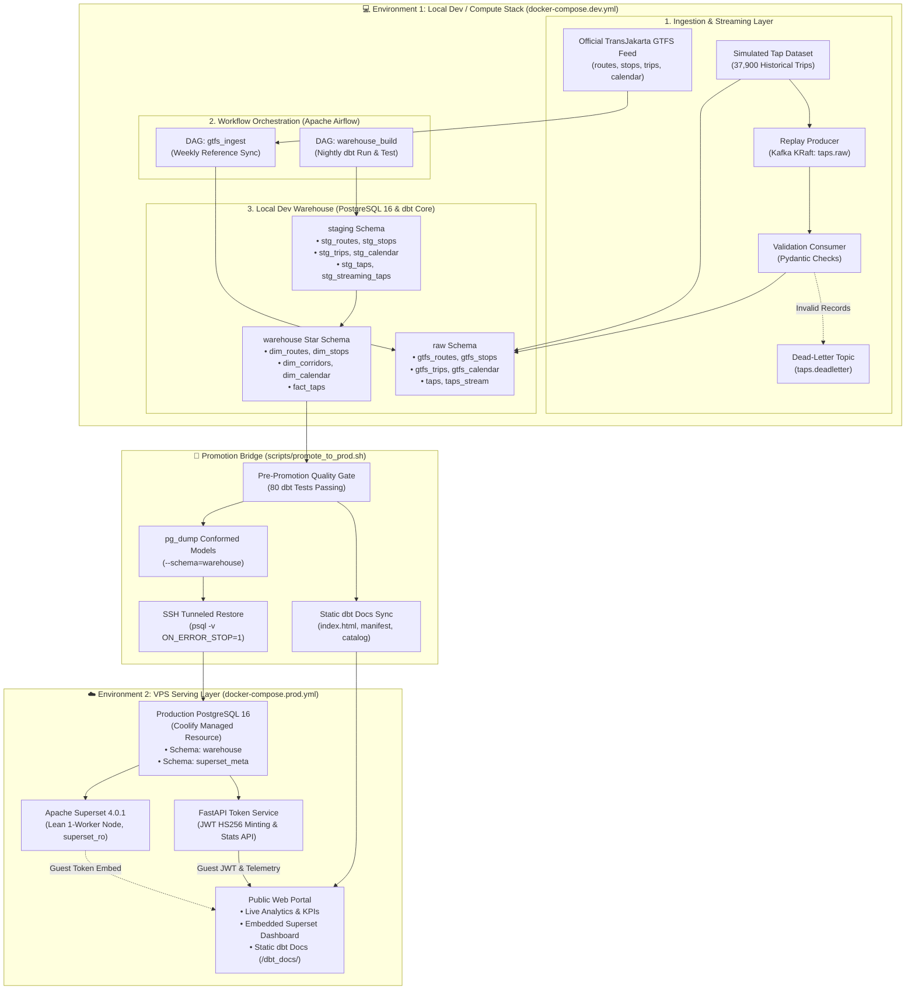
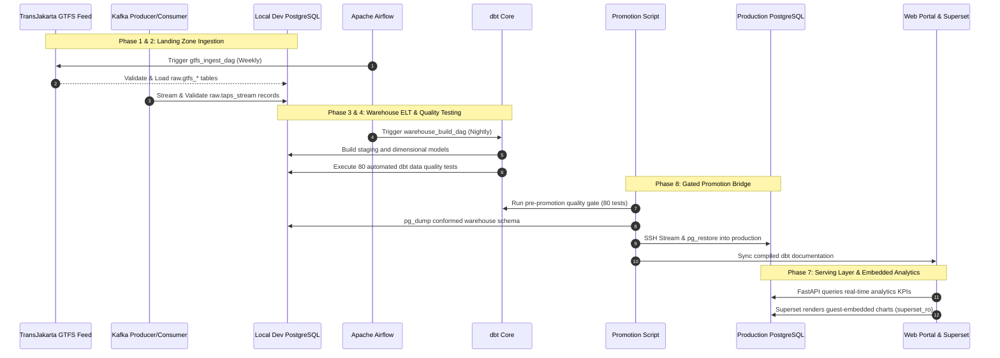
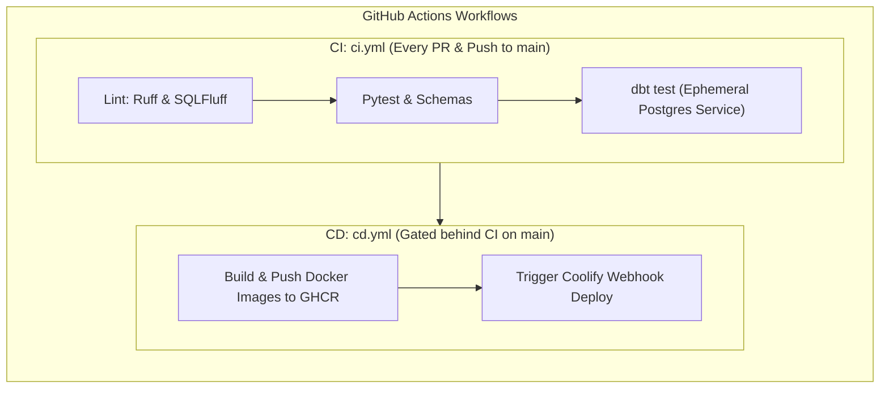

# Architecture & System Design — KoridorTJ

KoridorTJ is designed as an end-to-end modern data engineering and business intelligence platform built on Jakarta's TransJakarta Bus Rapid Transit (BRT) network.

This document details the architectural principles, component topology, two-environment split, data flow lifecycles, and governance boundaries implemented across the platform.

---

## 1. Architectural Philosophy & Two-Environment Split

Production transit data pipelines require substantial compute resources for ingestion, event streaming, data quality validation, and ELT transformations. However, serving pre-computed dimensional models and dashboards to external stakeholders requires minimal, stable compute.

To optimize operational cost and respect hardware constraints on a 1 vCPU / 2GB RAM Virtual Private Server (VPS), KoridorTJ implements a **strict separation of concerns between Compute and Serving**:

---

## 2. Environment Breakdown

### Environment 1: Local Dev / Compute Stack
- **Purpose**: Heavy batch processing, GTFS downloads, Kafka streaming simulation, Airflow scheduling, and dbt transformation runs.
- **Specification**: Executed locally via [`docker-compose.dev.yml`](../docker-compose.dev.yml).
- **Isolation Guarantee**: Dev workloads are completely isolated from production. No Airflow DAG or Kafka consumer connects to the VPS.
- **Container Footprint**:
  - `postgres-dev`: PostgreSQL 16 database hosting `raw`, `staging`, and `warehouse` schemas.
  - `kafka`: Apache Kafka 3.7 running in KRaft mode (no Zookeeper required).
  - `airflow-webserver` & `airflow-scheduler`: Apache Airflow 2.9 (LocalExecutor) orchestrating ETL tasks.
  - `producer` & `consumer`: Python workers replaying and validating streaming transit taps.

### Environment 2: VPS Serving Layer
- **Purpose**: Always-on, secure public serving of pre-computed analytical models, interactive Superset dashboards, and static dbt documentation.
- **Specification**: Hosted on a lightweight VPS (1 vCPU / 2GB RAM budget) orchestrated via **Coolify** and [`docker-compose.prod.yml`](../docker-compose.prod.yml).
- **Resource Constraints**:
  - PostgreSQL 16: Capped at `384 MB` RAM.
  - Superset (Lean Node): Single worker (`WEB_CONCURRENCY=1`), no Celery/Redis background queues, capped at `600 MB` RAM.
  - FastAPI Microservice: Capped at `128 MB` RAM.
  - Total VPS Memory Footprint: **~1.1 GB**, leaving plenty of headroom.

---

## 3. Data Pipelines & Flow Lifecycle

### Ingestion Details
1. **GTFS Ingestion (`ingestion/gtfs_ingest.py`)**:
   - Downloads the official TransJakarta GTFS archive (`file_gtfs.zip`).
   - Parses `routes.txt`, `stops.txt`, `trips.txt`, and `calendar.txt` using chunked pandas ingestion.
   - Enforces Pydantic schema validation (`ingestion/schemas.py`).
   - Stamps audit lineage fields (`_ingested_at`, `_source_url`) into `raw` schema tables.
2. **Streaming Tap Ingestion (`ingestion/replay_producer.py` & `ingestion/tap_consumer.py`)**:
   - Replays historical tap records with configurable time acceleration (e.g. 60x real-time).
   - Produces JSON payloads to Kafka topic `taps.raw`.
   - Consumer validates events with Pydantic; valid records are batched into `raw.taps_stream`, while malformed payloads land in `taps.deadletter`.

### Transformation & Star Schema Modeling (`dbt/`)
1. **Staging Layer (`staging` schema)**:
   - Sanitizes text, parses timestamps, extracts corridor identifiers from route short names, and computes trip duration intervals.
   - Unions batch transactions (`stg_taps`) and incremental streaming transactions (`stg_streaming_taps`).
2. **Warehouse Layer (`warehouse` schema)**:
   - Conforms core transit entities into an analytical star schema:
     - `dim_routes`: 270 routes with BRT classification and color badges.
     - `dim_stops`: 8,445 stops with WGS84 geographic coordinates and corridor associations.
     - `dim_corridors`: 270 corridor summary dimensions.
     - `dim_calendar`: Date dimension with weekday/weekend indicators and calendar quarters.
     - `fact_taps`: 72,300+ granular tap-in and tap-out fact records with surrogate keys (`tap_id`).

---

## 4. Promotion Bridge & Security Model

The promotion bridge (`scripts/promote_to_prod.sh`) is the sole mechanism for publishing validated data from the local compute environment to the public VPS:

1. **Strict Quality Gate**: Executes `dbt test --target dev`. If any single test fails, the promotion script aborts immediately with exit code 1.
2. **Schema-Isolated Dump**: Dumps only the conformed analytical models (`--schema=warehouse`), leaving staging and raw tables in dev.
3. **Encrypted Tunnel**: Streams the SQL dump through an authenticated SSH tunnel directly into `psql -v ON_ERROR_STOP=1` inside the production database container.
4. **Role-Based Least Privilege**:
   - `postgres` (Superuser): Used only during internal migrations and data restore.
   - `superset_ro` (Read-Only User): Granted strictly `SELECT` permissions on `warehouse.*` tables and `superset_meta`. Cannot perform `INSERT`, `UPDATE`, `DELETE`, or schema modifications.
   - `token-service`: Connects to `warehouse` with read-only credentials to aggregate real-time KPI metrics.
5. **Static dbt Docs Sync**: Generates and pushes compiled `manifest.json`, `catalog.json`, and `index.html` to `/app/web/dbt_docs/` on the VPS for public exploration.

---

## 5. CI / CD Lifecycle

- **Continuous Integration (`.github/workflows/ci.yml`)**:
  - Validates Python code style and formatting via **Ruff**.
  - Validates SQL formatting and dbt Jinja templating via **SQLFluff**.
  - Executes unit and API test suites via **Pytest**.
  - Spins up an ephemeral PostgreSQL service container, runs `dbt seed`, `dbt run`, and verifies all **80 dbt data quality tests**.
- **Continuous Deployment (`.github/workflows/cd.yml`)**:
  - Builds optimized Docker container images for `token-service`.
  - Publishes multi-arch images to GitHub Container Registry (GHCR).
  - Triggers Coolify webhook API to redeploy the serving layer on the VPS.
  - **Data Safety Guarantee**: CD deploys application code only; data is never automatically pushed to production from Git.

---

## 6. Data Governance & Disclaimer Standard

To ensure ethical data practices and compliance:
- **Reference Data**: Official TransJakarta GTFS feed published under Creative Commons Attribution 4.0 International (CC BY 4.0).
- **Fact Data**: Simulated tap-in/tap-out transaction records generated for portfolio demonstration purposes.
- **Compliance Enforcement**: Every analytical model and reporting query enforces `is_simulated = TRUE`, and public disclaimers are prominently displayed in `README.md`, the web portal banner, and API health responses.

