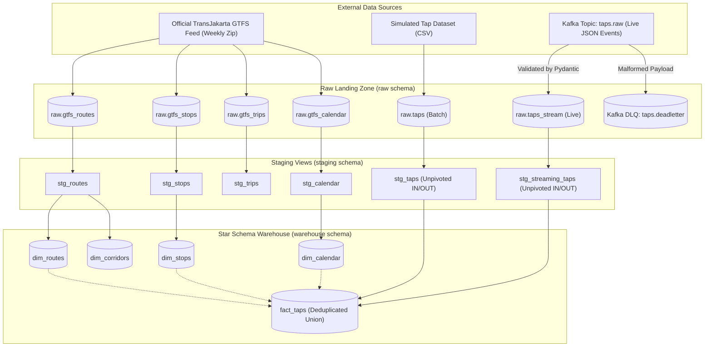

# Entity Relationship Diagram (ERD) — KoridorTJ

This document outlines the conceptual and physical data models for the KoridorTJ data platform, detailing the star schema relationships and the end-to-end data pipeline lineage.

---

## 1. Dimensional Star Schema (Warehouse Layer)

The warehouse layer models passenger tap transactions as a central fact table (`fact_taps`) joined with conformed transit dimensions (`dim_routes`, `dim_stops`, `dim_corridors`, `dim_calendar`).

```mermaid
erDiagram
    dim_routes ||--o{ fact_taps : "served_by (route_id)"
    dim_stops ||--o{ fact_taps : "boarded_at_or_alighted_at (stop_id)"
    dim_calendar ||--o{ fact_taps : "occurred_on (date_id)"
    dim_corridors ||..o{ fact_taps : "operates_along (corridor_code)"

    fact_taps {
        varchar(110) tap_id PK "Surrogate PK (<trans_id>_IN / <trans_id>_OUT)"
        varchar(100) trans_id "Transaction ID linking trip event pairs"
        varchar(100) pay_card_id "Anonymized smart card identifier"
        varchar(100) pay_card_bank "Card issuer (emoney, flazz, bni, dki)"
        varchar(255) pay_card_name "Passenger cardholder name"
        varchar(10) pay_card_sex "Gender (M / F)"
        int pay_card_birth_date "Birth year"
        varchar(100) route_id FK "References dim_routes(route_id)"
        varchar(100) stop_id FK "References dim_stops(stop_id)"
        int date_id FK "References dim_calendar(date_id)"
        varchar(100) corridor_code "Corridor designation code"
        int direction "0 = Outbound, 1 = Inbound"
        varchar(10) tap_type "IN (Boarding) / OUT (Alighting)"
        timestamp tap_timestamp "Gate validation timestamp"
        int stop_sequence "Stop order along route"
        numeric(10,2) pay_amount "Fare charged in IDR (Rp 3,500 / Rp 0)"
        boolean is_simulated "Compliance flag (always TRUE)"
        timestamptz _ingested_at "Warehouse ingestion timestamp"
    }

    dim_routes {
        varchar(100) route_id PK "Unique route code (1, 9C, GR1)"
        varchar(100) route_short_name "Public badge code"
        varchar(255) route_long_name "Full descriptive route endpoint title"
        varchar(255) route_name "Standardized route title"
        varchar(255) route_desc "Category (BRT, Non-BRT, Mikrotrans)"
        int route_type "GTFS code (3 = Bus/BRT)"
        varchar(20) route_color "Hex color code"
        varchar(20) route_text_color "Hex text color"
    }

    dim_stops {
        varchar(100) stop_id PK "Unique stop identifier (1-1, P00142)"
        varchar(100) stop_code "Public shelter code"
        varchar(255) stop_name "Public stop name"
        varchar(255) stop_desc "Location description"
        double_precision latitude "WGS84 Latitude [-7.0, -5.5]"
        double_precision longitude "WGS84 Longitude [106.3, 107.5]"
        int location_type "0 = Stop/Platform, 1 = Station"
        varchar(100) parent_station "Parent station ID if nested"
        int wheelchair_boarding "Accessibility flag"
    }

    dim_corridors {
        varchar(100) corridor_code PK "Corridor code (1, 2A, 6C)"
        varchar(255) corridor_name "Corridor descriptive endpoints"
    }

    dim_calendar {
        int date_id PK "Integer surrogate key (YYYYMMDD)"
        date full_date "Calendar date (YYYY-MM-DD)"
        int year "4-digit year"
        int quarter "Quarter (1 to 4)"
        int month "Month number (1 to 12)"
        varchar(20) month_name "Month title (April, September)"
        int day_of_month "Day number (1 to 31)"
        int day_of_week "ISO day (1 = Mon, 7 = Sun)"
        varchar(20) day_name "Weekday name (Monday, Sunday)"
        boolean is_weekend "TRUE if Saturday or Sunday"
    }
```

---

## 2. Ingestion & Transformation Lineage

The diagram below illustrates how raw GTFS reference feeds, historical transaction batches, and real-time Kafka streams flow through Staging and into the conformed Warehouse layer.



---

## 3. Data Integrity & Key Cardinalities

1. **`dim_routes` (1) to `fact_taps` (N)**:
   - Every tap transaction references exactly one conformed route.
   - Enforced by dbt foreign key test `relationships_fact_taps_route_id`.

2. **`dim_stops` (1) to `fact_taps` (N)**:
   - Every tap transaction references exactly one validated transit stop.
   - Enforced by dbt foreign key test `relationships_fact_taps_stop_id` and singular test `assert_fact_taps_referential_integrity.sql`.

3. **`dim_calendar` (1) to `fact_taps` (N)**:
   - Every tap transaction references exactly one integer date surrogate key (`date_id = YYYYMMDD`).
   - Enforced by dbt foreign key test `relationships_fact_taps_date_id`.

4. **Batch & Streaming Deduplication**:
   - `fact_taps` implements `DISTINCT ON (tap_id)` ordered by `_ingested_at DESC` to ensure idempotent reloading if events are replayed or updated.
